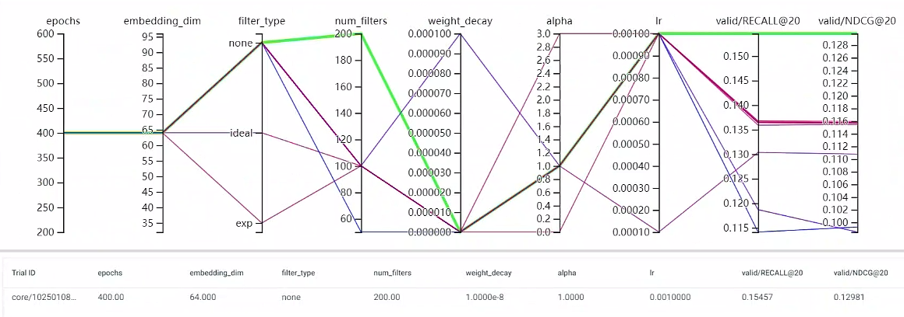
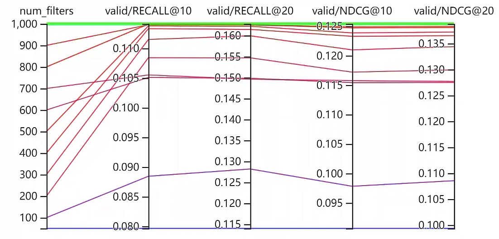
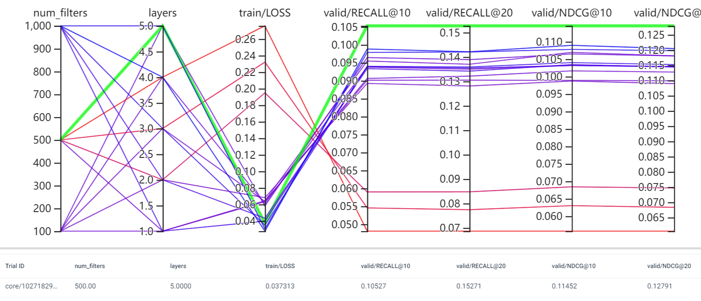
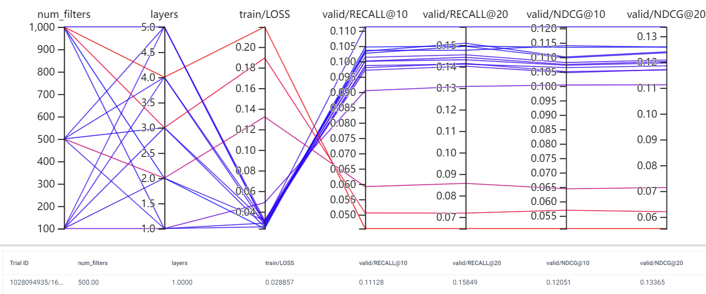
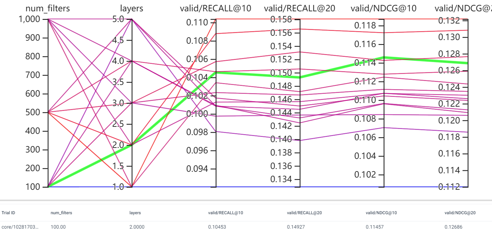

# LightGCN-Slim


## 基础测试

将 LightGCN 的 $E$ 替换为
$$
V h(\sigma) W
$$
其中 $V$ 是特征向量, $W$ 是可训练的参数.

```yaml
command: python main.py
envs:
  root: ../../data
  dataset: Gowalla_m1
  device: 0,1,2
params:
  filter_type: [none, ideal, exp]
  num_filters: [50, 100, 200]
  weight_decay: [0., 1.e-8, 1.e-4]
  alpha: [0., 1., 3.]
  lr: [1.e-3, 1.e-4]
defaults:
  epochs: 400
  embedding_dim: 64
  filter_type: none
  num_filters: 100
  weight_decay: 1.e-8
  alpha: 1.
  lr: 1.e-3
```




结论:

1. 对特征向量的特征值采取:
    $$
    h(\sigma) = \sigma, \: h(\sigma) = 1, \: h(\sigma) = e^{-\beta \sigma}
    $$
    的影响似乎不大, 当然有可能是别的参数设置不怎么好影响了;

2. 保留的特征向量的数量很重要, $200$ 是结果最好的, 等等再测试一下.


## num_filters


```yaml
command: python main.py
envs:
  root: ../../data
  dataset: Gowalla_m1
  device: 0,1,2
params:
  # filter_type: [none, ideal, exp]
  num_filters: [50, 100, 200, 300, 400, 500, 600, 700, 800, 900, 1000]
  # weight_decay: [0., 1.e-8, 1.e-4]
  # alpha: [0., 1., 3.]
  # lr: [1.e-3, 1.e-4]
defaults:
  epochs: 400
  embedding_dim: 64
  filter_type: none
  num_filters: 100
  weight_decay: 1.e-8
  alpha: 1.
  lr: 1.e-3

```




结论:

1. 特征向量的 $K$ 目前为止是大一点比较好.


## num_layers

```
command: python main.py
envs:
  root: ../../data
  dataset: Gowalla_m1
  device: 0,1,2
params:
  num_filters: [100, 500, 1000]
  layers: [1, 2, 3, 4, 5, 6, 7]
  # filter_type: [none, ideal, exp]
  # weight_decay: [0., 1.e-8, 1.e-4]
  # alpha: [0., 1., 3.]
  # lr: [1.e-3, 1.e-4]
defaults:
  epochs: 400
  embedding_dim: 64
  filter_type: none
  weight_decay: 1.e-8
  alpha: 1.
  lr: 1.e-3
```


结论:

1. 这种情况很容易 over-smoothing


## 加上线性层





结论:

1. 加上线性层之后就变得训练困难了;

2. 加上激活函数会有所好转:



注: 上面的有些出现很差的结果, 并不是真的很差, 是代码里面有一个 bug.


## 线性层 + 激活函数





现象:

1. 对于 100, 500 filters, 都是随着层数加深效果变差.


