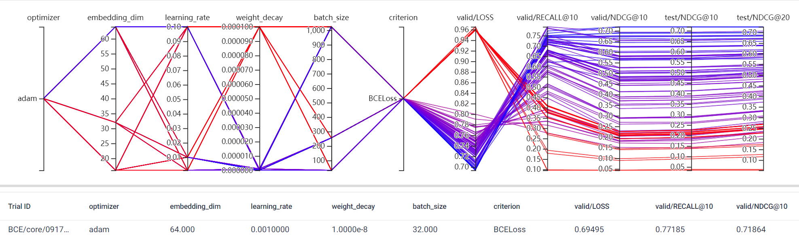
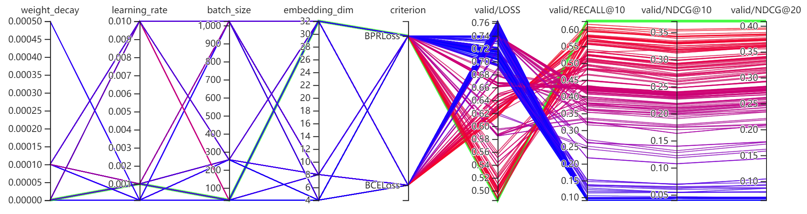
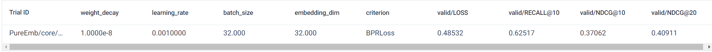
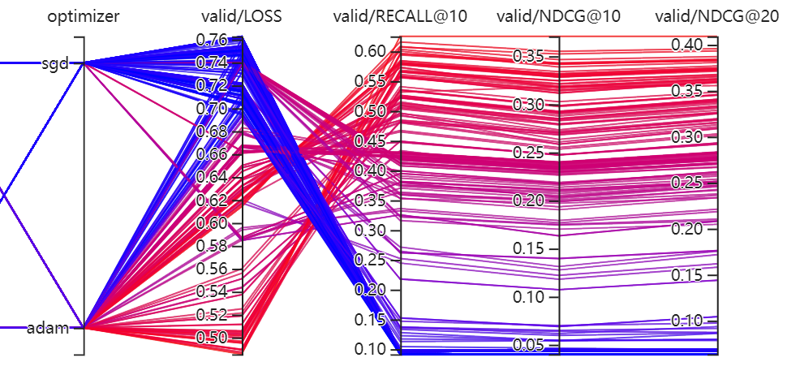
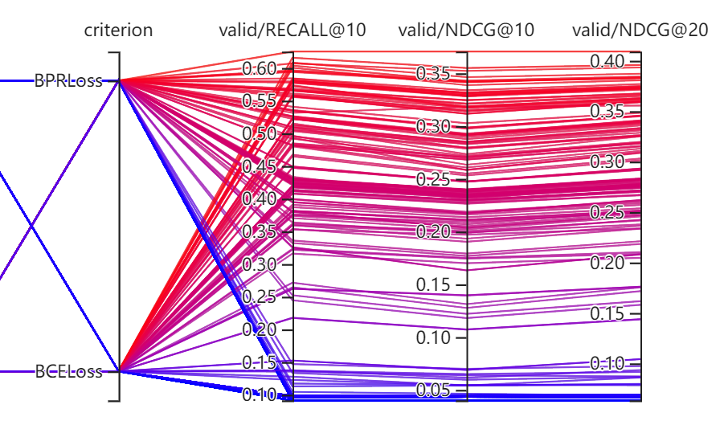
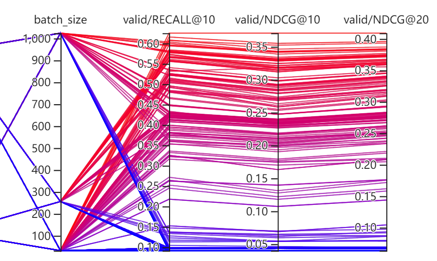
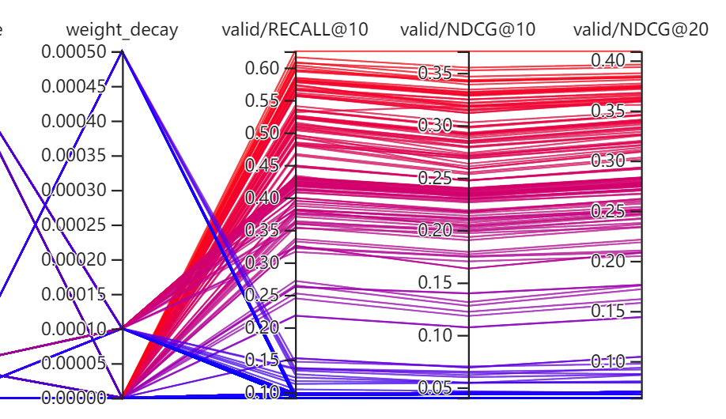

# 纯 Embedding 测试

在了解更加复杂的模型之前, 我想了解一下仅仅用 embeddings 能够取得怎么样的一个结果.

## 算法

- 初始化 embeddings $U \in \mathbb{R}^{M \times d}, I \in \mathbb{R}^{N \times d}$;
- 通过如下方式获取 score:
    $$
    s(u, i) = u^T i;
    $$
- 通过 BCELoss 或 BPRLoss 在 MovieLens1M 上进行训练;
- 需要说明的是, 评价采用的采样的方法 (而不是用全部的 items).

## 测试结果1 [BUG]

1. 这是我进行 grid_search 的一个结果, 这里比较异常的一个点是 Recall@10, NDCG@10 能达到很高, 然后检查代码发现这是因为测试的负样本和训练的负样本重了, 所以不断增加 embedding_dim 的效果会这么明显;
2. 然后还有比较奇怪的一个点是, 即使代码出现了上面的问题, 为什么会出现 batch_size 越小效果越好呢 ? 难道 batch_size 小了更容易过拟合?

### 测试结果2

1. 最好的结果如下:

结果正常了, 但是出人意料还挺好, 没有想象中那么差;

2. adam 似乎总是比 sgd 好:

这个我感觉是 learning_rate 配置的问题, 因为 sgd 在小的学习率上很容易崩, 我感觉是容易过拟合的缘故, 在大的学习率上也还可以;

3. BPRLoss 比 BCELoss 更加稳定, 虽然在某些配置下, BCELoss 也能取得不错的结果, 不过这可能和我负样本都是取 1 个有关:

4. 关于 batch_size 是很奇怪的, 依然是 batch_size 比较小的时候能取得一个最佳的效果, 因为这个实验其实完全没有共享的参数, 所以 batch_size 仅仅影响学习率和更新频率而已. 而这大概率不是学习率引起的, 因为用大的学习率不会有有什么优势, 所以大概率就是一个更新频率的缘故. 这个也有道理, 因为如果采用大的 batch_size, 可能很长时间内那些不活跃的结点就不会得到更新, 状态很滞后, 这个有待在更复杂的模型上检验.

5. 并没有发现很明显的过拟合的现象, weight_decay 对于这个类型的似乎没有太大的作用 (虽然 1e-8 会比 0 好上那么一点):

