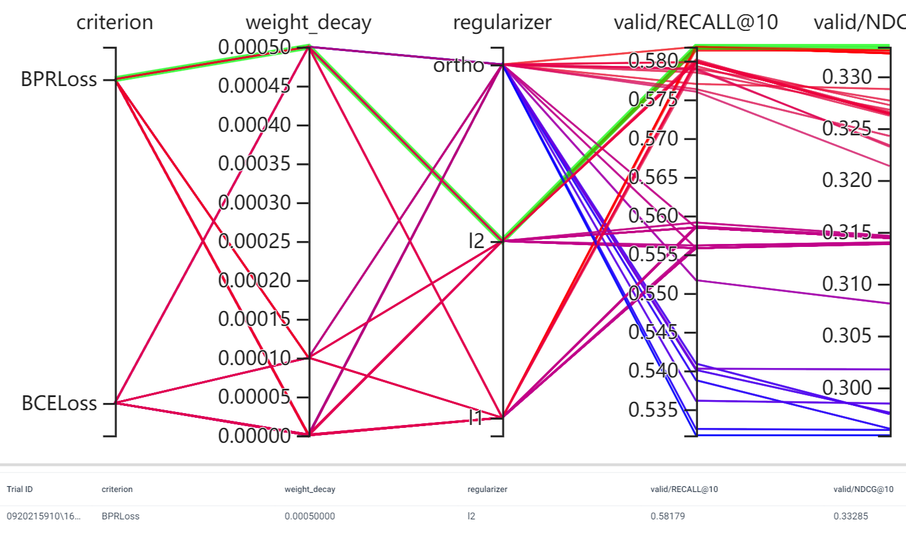
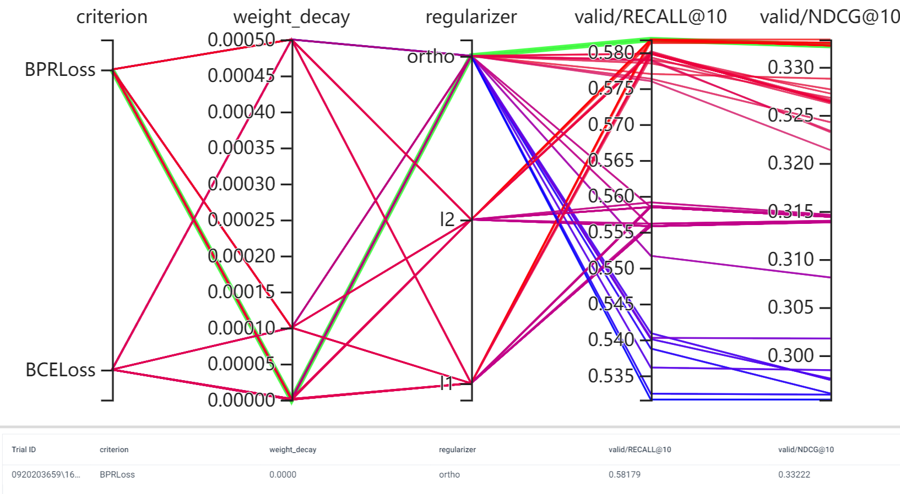
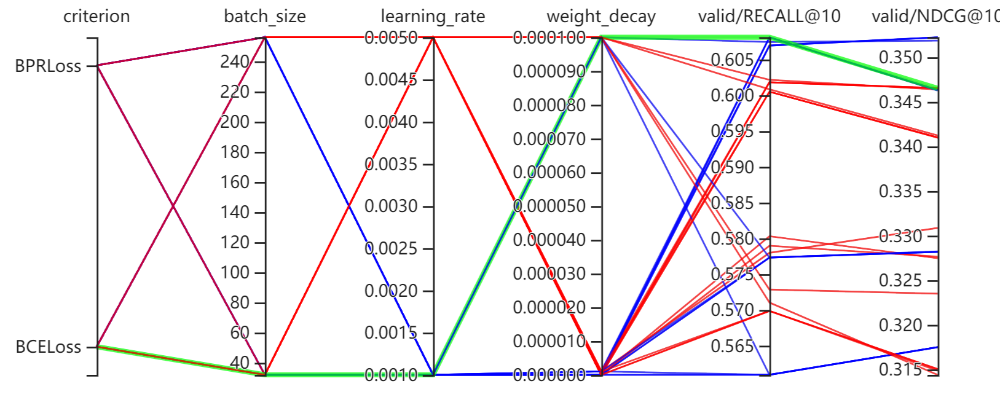

# 正则化项


我想测试下正则化项的影响, 假设 Embeddings 是 $W \in \mathbb{R}^{n \times d}$, 考虑如下的几种正则化项:
- L2: $\frac{1}{2} \|W\|_2^2$;
- L1: $\|W\|_1$;
- 正交化: $\frac{1}{2}\sum_{i\not =j} ([W^TW]_{ij})^2$


## 测试结果 1

```
command: python main.py
envs:
  root: ../../data/MovieLens1M
  dataset: MovieLens1M
  device: 0,1,2,3
params:
  criterion: [BPRLoss, BCELoss]
  weight_decay: [0, 1e-8, 1-6, 1e-4, 5e-4]
  regularizer: [ortho, l2, l1]
defaults:
  optimizer: adam
  batch_size: 256
  embedding_dim: 32
  epochs: 20
  learning_rate: 1e-4
```

注意: 这里我并没有用上次说的最佳的一个 batch_size = 32 (因为感觉这个参数可能并不适合所有的正则化方式).



1. 从上图可以看出, 依旧是 $L_2$ 有一个最佳的结果;
2. 从下图可以看出, $L_1$ 或者是 正交化 完全起不到效果, 因为二者都是在 weight_decay = 0 的时候效果最佳, 所以可以说是压根没有用.


感觉正交化不起作用的一个原因是
$$
\min_{W} [W^TW]_{ij}
$$
会导致 $W \rightarrow 0$, 接下来尝试
$$
\min_{W} \sum_{i\not=j} (\cos(W_{:, i}, W_{:, j}))^2
$$
试试.


## 测试结果 2

利用
$$
\min_{W} \sum_{i\not=j} (\cos(W_{:, i}, W_{:, j}))^2
$$
进行一个测试, 得到如下的一个结果:



  
最好的结果是:


1. 正交化似乎并没有特别大作用, 我本来以为通过正交化, 会迫使那些很少样本的 embeddings 也能够得到更新, 但是结果不对, 因为还是 batch_size=32 是达到最佳的, 可能还是需要改进;
